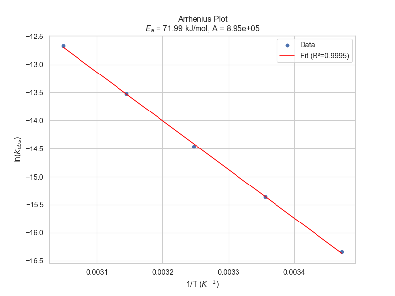

# Experiment 5: Final Kinetic Analysis Report

**Date**: 2026-02-12 17:10
**Anion Configuration**: Cl- (Salt Factor: 1.0)

## 1. Thermodynamic Parameters
- **Activation Energy ($E_a$)**: 71.99 kJ/mol
- **Pre-exponential Factor ($A$)**: 8.95e+05 $s^-1$
- **Arrhenius Linearity ($R^2$)**: 0.9995

## 2. Experimental Data Summary
| File | Temp (K) | $k_{obs}$ (M/s) | $k_{intrinsic}$ (M/s) | Linearity ($R^2$) |
| :--- | :--- | :--- | :--- | :--- |
| run_288K.csv | 288 | 8.06e-08 | 8.06e-08 | 0.8793 |
| run_298K.csv | 298 | 2.13e-07 | 2.13e-07 | 0.9849 |
| run_308K.csv | 308 | 5.24e-07 | 5.24e-07 | 0.9963 |
| run_318K.csv | 318 | 1.34e-06 | 1.34e-06 | 0.9994 |
| run_328K.csv | 328 | 3.15e-06 | 3.15e-06 | 0.9908 |
